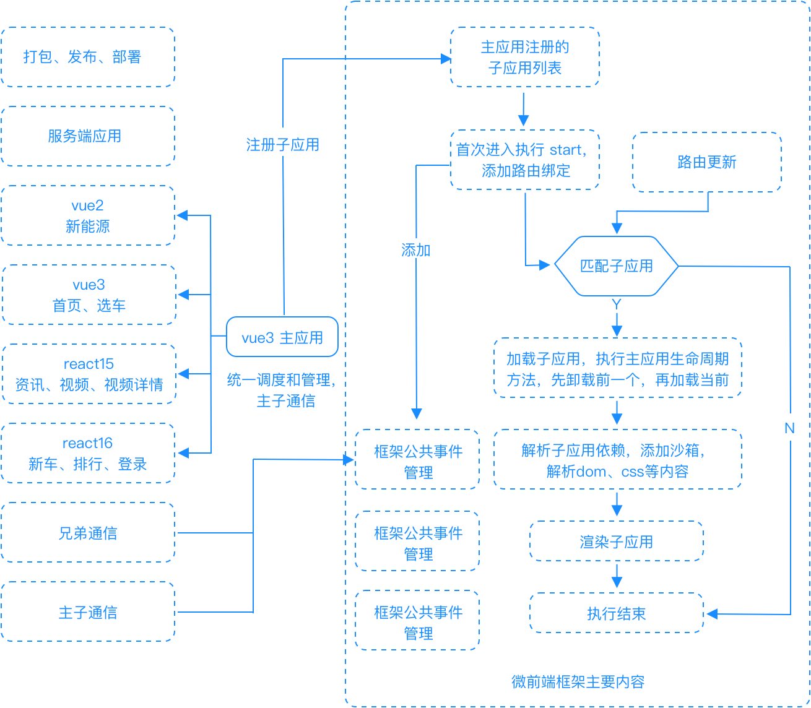

# 介绍

目标：

- 高质量代码
- 从零开发自己的微前端框架
- 全流程：子应用->主应用->服务端->发布平台
- 源码解析：剖析现有微前端框架 --- qiankun、single-spa
- 使用成熟框架重构现有项目

内容：

- 架构基础知识，打牢基础
- 技术提升
  - 从零开发自己的微前端框架
  - 覆盖应用开发、框架开发、后端开发、发布平台等
- 技术栈
  - 前端：vue2、vue3、raect15、raect16
  - 后端：koa
  - 发布平台：express

