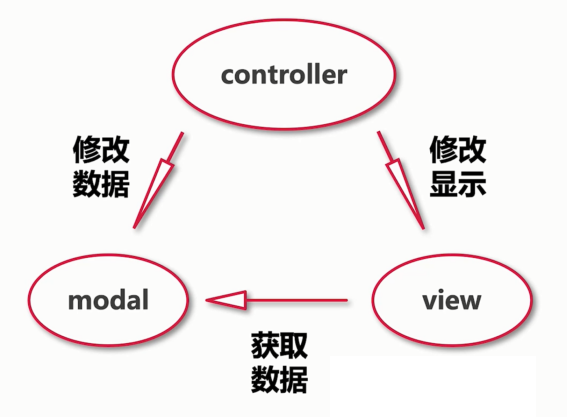
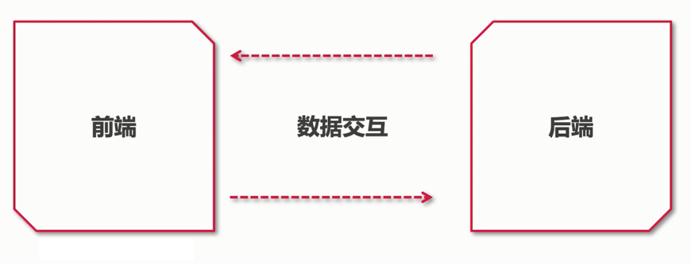
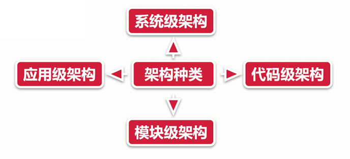

# 架构基础知识

万变不离其宗，没有一种架构是凭空想象出来的，每一种架构实践方式都是有基础的内容搭建起来的.

## 前端架构的前世今生

架构是如何产生的？

- 初始：无架构，前端代码内嵌到后端应用中。

**后端 mvc 架构**：

- 将视图层、数据层、控制层做分离
- 缺点：重度依赖开发环境，代码混淆严重

**前后端分离架构**：

- 将前端代码从后端环境中提炼出来（ajax 促进了前后端分离架构的发展）多页面架构
- 缺点：前端缺乏独立部署能力，整体流程依赖后端环境

**Nodejs 的广泛使用促进了前端技术的快速发展**：

- 各种打包、构建工具应运而生
- 诞生了多元化前端开发方式，使得前端开发可以脱离整个后端环境

**单页面架构**：

- 打包：gulp、rollup、webpack、vite ...
- 框架：vue、react、Angular ...
- ui 库：antd、iview、elementui、mintui ...

单页面架构 - 优势：

- 切换页面无刷新浏览器，用户体验好
- 组件化开发方式，极大提升了代码复用率

单页面架构 - 劣势：

- 不利于 SEO，首屏渲染会出现较长时间的白屏（可解决）

**大前端时代**：

- 后端框架：Express 、koa
- 包管理工具：npm、yarn
- node 版本管理：nvm

**总结**：

- 过于灵活的实现也导致了前端应用拆分过多，维护困难
- 往往一个功能或需求会跨两三个项目进行开发

**微前端等新型架构** - 天下大势合久必分分久必合

- 技术栈无关
- 主框架不限制接入应用的技术栈，微应用具备完全自主权
- 独立开发、独立部署
- 增量升级
- 微前端是一种非常好的实施`渐进式重构`的手段和策略
- 微应用仓库独立，前后端可独立开发，主框架自动完成同步更新
- 独立运行时
- 每个微应用之间状态隔离，运行时状态不共享

微前端架构劣势：

- 接入难度较高
- 应用场景：移动端少，管理端多

## 软件设计原则与分层

### **软件设计原则**

单一职责原则：

- 永远不应该有多于一个原因来改变某个类
- 理解：对应一个类而言，应该仅有一个引起它变化的原因。
- 应用：如果每一个类拥有两种职责，那就可以将这个类分成两个类。

开放封闭原则：

- 软件实体扩展应该是开放的，但对于修改应该是封闭的。
- 理解：对扩展开放、对修改封闭。`可以去扩展类，但不要去修改类`。
- 应用：当需求有改动，尽量用继承或组合的方式来扩展类的功能，而不是直接修改类的代码。

里氏替换原则：

- 理解：父类一定能够被子类替换

最小知识原则：

- 只与你最直接的对象交流。
- 理解：低耦合、高内聚。
- 应用：做系统设计时，尽量减小依赖关系。

接口隔离原则：

- 一个类与另一个类之间的依赖性，应该依赖于尽可能小的接口。
- 理解：不要对外暴露没有实际意义的接口。用户不应该依赖它不需要的接口。
- 应用：当需要对外暴露接口时，如果是非必要对外提供，尽量删除。

依赖倒置原则：

- 高层模块不应该依赖于低层模块，他们应该依赖于抽象。抽象不应该依赖于细节，细节应该依赖于抽象。
- 理解：应该面向接口编程，不应该面向实现类编程。
- 并不是说，所有的类都要有一个对应的接口，而是说，如果有接口，那就尽量使用接口编程吧。

总结：

- 将以上六大原则的我·英文首字母拼在一起就是 SOLID（稳定的），所以也称之为 SOLID 原则。
- 只有满足这六大原则，才能设计出稳定的软件架构！

### **补充设计原则**

组合/聚合复用原则：

- 当要扩展类的功能时，优先考虑使用组合，而不是继承。
- 该原则在 23 种经典设计模式中频繁使用。
- 如：代理模式、装饰模式、适配器模式等。

无环依赖原则：

- 当 A 模块依赖于 B 模块，B 模块依赖于 C 模块，C 模块依赖于 A 模块时，此时将出现循环依赖。
- 在设计中避免该问题，可通过引入“中介者模式”解决。

共同封装原则：

- 应该将易变的类放在同一个包里，将变化隔离出来。
- 该原则是“开放-封闭原则”的延生。

共同重用原则：

- 如果重用了包中的一个类，那么也就相当于重用了包中的所有类，我们要尽可能减小包的大小。

好莱坞原则：

- Don‘t  call me，I'll call you
- 控制反转（或称为“依赖注入”）
- 不需要主动创建对象，而是由容器帮我们来创建并管理这些对象。

不要重复你自己：

- 不要让重复的代码到处都是，要让他们足够的重用，所以要尽量可能的封装。

保持它简单与傻瓜：

- 保持系统界面简洁，功能实用，操作方便。

高内聚与低耦合：

- 模块内部需要做到内聚度高，模块之间需要做到耦合度低。

关注点分离：

- 将一个负责的问题分离为多个简单的问题，然后逐个解决。
- 难点：如何进行分离

你不需要它：

- 不要一开始就把系统设计的非常复杂，不要陷入“过度设计”的深渊。
- 让系统足够简单，而又不失扩展性。

## 软件设计分层

**系统级架构**

- 应用在整个系统内，如与后台服务如何通信，与第三方系统如何继承。
- 设计前端首要条件：了解前端系统与其他系统之间的关系。
- 关系包括：业务关系和协作机制。
- 设计后端：只需要规定与后台数据传递的机制。
- 包括：api 设计规则，访问授权的一个开放标准 (OAuth) 跳转 token的校验，数据传递 cookie 等
- 前端与后端的关系考虑的主要因素是：前后端分离的架构设计。
- 前后端分离架构其实是如何实施技术决策，用户鉴权，API 接口管理和设计、API 文档管理、Mock 的使用、BFF（服务于前端的后端，Nodejs）、是否需要服务端渲染等。

微前端

- 在一个系统内微前端是应用间的架构方案
- 在多个应用之间，微前端则是一种系统间等架构方案
- 微前端是将多个前端应用以某种形式结合在一起进行应用。
- 旨在解决单体应用在一个相对长的时间跨度下，由于参与的人员、团队的增多、变迁，从一个普通应用演变成一个巨石应用（Frontend Monolith）后，随之而来的应用不可维护的问题。

- 单实例：即同一时刻，只有一个子应用被展示，子应用具备一个完整的应用生命周期。
- 单、多实例：通常基于 url 的变化来做子应用的切换。
- 多实例：同一时刻可展示多个子应用。
- 通常使用 Web Components 方案来做子应用封装，子应用更像是一个业务组件而不是应用。

**应用级架构**

- 应用级架构可以看作是系统架构的细化。
- 单个应用于其他外部应用的关系，微服务架构下多个应用的协作，数据交换等。
- 脚手架
- 模式库
- 设计系统

**模块级架构**

- 这部分内容是我们开始业务编码之前进行设计，我们称为迭代。

**代码级架构**

- 规范与原则
- 开发流程
- 代码质量以及改善
- 规范而非默契

整体软件开发过程中需要注意的内容：

- 在开发中，要注意可维护性
- 简单的代码可维护性高；越是写的抽象的代码越难维护。

## 架构设计的质量-健壮性和稳定性

**系统的稳定性**：

定义：当一个实际的系统处于一个平衡的状态时，如果受到外来作用的影响时，系统经过一个过渡过程仍然能够回到原来的平衡状态，我们称这个系统就是稳定的，否则称系统不稳定。

- 架构设计的基石
- 可以更好的实现自我修复

**系统的健壮性**：

计算机软件在输入错误、磁盘故障、网络过载或有意攻击情况下，能否不死机、不崩溃，就是该软件健壮性的具体表现。

解释：一个系统容错能力强，运行不易被干扰，安全性好

鲁棒性（robustness）就是系统的健壮性。

系统健壮性的度量标准：

- 一个软件可以从错误的输入推断出正确合理的输入。
- 一个软件可以正确的运行在不同的环境下。
- 一个软件能够检测到自己内部的设计或者编码错误，并得到正确的结果。

**系统的健壮性和稳定性**：

- 健壮性和稳定性是特定的软件自身的要求。
- 健壮性和稳定性是软件处理的一部分。
- 软件架构的健壮性和稳定性是该软件在规划时所确定的目标
- 若软件的实现未达到原定目标，则该软件的健壮性和稳定性不够或不好

**架构质量的衡量**：

- 扩展性
- 维护性
- 可管理
- 高可用（故障修复、容灾、降级、熔断）

**日常开发过程中的架构质量**：

- 理解难度
- 接入依赖的成本
- 奔溃率和错误率的指标
- 开发效率
- 错误上报和信息收集等功能

## 架构前期准备

正确的选择是良好的开端

架构师分类：

- 系统架构师
- 应用架构师
- 业务架构师

系统架构师：

- 从系统的维度，负责整体系统的架构设计
- 主要是基础服务和各系统间协调，着眼全局。
- 比如关注负载，可靠性，伸缩，扩展，整体项目切分，缓存应用等方面的基础架构设计。

应用架构师：

- 从应用程序的维度，复杂某个应用的技术架构，主要偏业务系统。
- 关注理解业务，梳理模型，设计模式，接口，数据交互等方面。

业务架构师：

- 从业务流程的维度，关注某一个行业、业务的领域分析，获取领域模型，最终获得系统的模型。
- 也可以叫业务领域专家、行业专家、产品咨询师、资深顾问。

**技术前期准备**：

- 技术选型：社区氛围、发展规模、未来发展趋势、与当前团队的契合度、执行成本、维护和迁移成本、执行效率等内容的调研和报告。
- 充分调研每一项技术可能带来的利与弊。
- 最大程度上预测架构设计中的缺陷，以防止问题的发生。

**技术优化**：

- 在架构发展过程中，可能存在一些有悖于当前架构设计的实现，造成了架构发展阻塞，所以需要进行架构优化，使架构设计的适应性更高。

**架构优化**：

- 架构不是一蹴而就的，在业务发展过程中，架构也在不断演进。
- 对架构设计进行实时调优，使架构以后成为常态化。
- 通过不断的调整架构实现，改进初始架构中设计的不足，补足短板。

## 技术填补与崩溃预防

**千里之堤毁于蚁穴 - 技术债务填补与崩溃预防**

产生的原因：
- 开发过程中因为时间紧迫导致的实现不合理。
    - 举例：查找 10000 以内的质数。
    - 循环的方式。筛选法。
- 暂时没有想到更好的实现方式而妥协的版本
    - 刚开始使用 if ... else 实现
    - 演变为使用责任链模式
- 架构设计前期没有考虑到的细节
    - 交互细节 -> props 传递参数（交互冗余，流程较长）
    - 使用全局状态管理实现参数传递
- 不合理的交互设计，导致技术显示复杂。
- 旧功能文档缺失，无正确扩展、修改和兼容旧功能，导致上线后问题剧增。

后果：

- 修复变重构。
- 小的技术债务不做偿还，最后会演变成一场大规模的重构工作，导致产出不高。
- 影响开发速度。
- 技术债务的存在导致整体开发需要兼容的点过多，影响开发效率，极大影响上线速度，导致整体项目迭代缓慢，失去核心竞争力。
- 容易陷入恶性循环：维护旧功能 -> 开发新功能 -> 兼容旧功能 -> 维护旧功能 -> 开发新功能 -> ......

解决方案：

- 优秀的架构设计是基础
    - 必须能够有效处理当前需求可预见的情况，对于未知的，可能出现的特殊情况，很小的改动就能解决问题。
    - 根据当前的业务，进行合理的项目拆分，尽量的降低代码耦合度。
    - 必须有日志模块，操作日志、错误日志、业务日志等等
- 良好的技术培训和传帮带能力
    - 让每一位开发者可以从更深层次理解自己所需要实现的功能
    - 从最开始的代码规范、到熟悉业务、最后再到编写文档。
- 充分的技术方案可避免一部分技术债务的产生
    - 技术方案是充分理解需求之后所能产出的堆需求理想的实现方式，必要性不言而喻。
- 不同工程师直接可以相互 review
    - CodeReview 是非常重要的，同时也是自身的一个提高。
- 提升对修复技术债务重要性的认知
    - 工程师如果能预见一个债务可能导致的问题，自然愿意花时间去处理。
- 善于发现和定期处理一些技术债务。
    - 勇于发现系统中的技术债务，让自己为系统复杂。

总结：
- 等产品上线后，开发就没有那么紧啦，这个时间大家可以找个时间处理技术债务，一边建立感情，一边品味一下原来的代码，这种感觉极其酸爽。

**预防架构崩溃**

- 架构崩溃是严重的架构设计事故，也是我们需要预防的关键所在。
- 系统崩溃的产生
- 日志记录：如：操作记录、错误日志、业务日志等等。

崩溃预防：

- 用户行为抓取 -> 争取在最新时间获取到用户操作链条
- 解决存量问题 -> 技术债务
- 遏制新增 -> 减少新增问题的概率
- 对脏数据进行兜底和检验
- 单元测试
- 崩溃报警
- 自动化测试
- 更广的灰度触达
- 性能优化体系

## 系统重构

**推到？重来？- 系统重构**

- 架构不是永恒不变的。架构也是具体生命周期的。也会经历 初生、发展、颠覆、衰弱、消亡的过程。

**什么是重构？**

- 对软件内部结构的一种调整
- 目的是在不改变软件可观察行为的前提下，提高其可理解性，降低其修改成本。

实现方式：

- 使用一系列重构手法，在不改变软件可观察行为的前提下，调整其结构。

重构理念：

- 运用大量微小且保持软件行为的步骤，一步步达成大规模的修改

**早期系统优势**：

1. 开发速度快
2. 代码复杂度低
3. 代码规范都保持完好
4. 严格注重开发规范，不会允许危及架构设计的代码产生
5. 以上因素导致添加功能难度低，成本低

**晚期系统**：

1. 具备所有早期系统的劣势
2. 代码复杂度
3,. 代码规范不完善
4. 很多需求或功能出现逾越架构设计的情况
5. 添加新功能兼顾较多，涉及较多模块，牵一发而动全身

**`重构时机`**：

- 当发现一个现有架构体系已经不能满足当前迭代速度的时候就需要进行重构工作。

微重构：

- 对有`坏味道`的代码通过一些重构手段进行微重构。
- 重构流程：
    - 确定问题点，确定重构功能和范围
    - 旧架构设计和逻辑梳理
    - 稳定性保证
    - 性能保证
    - 需求过程中的冲突问题

