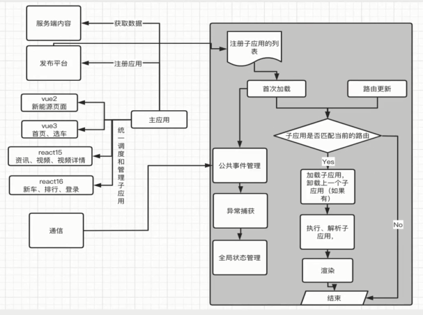
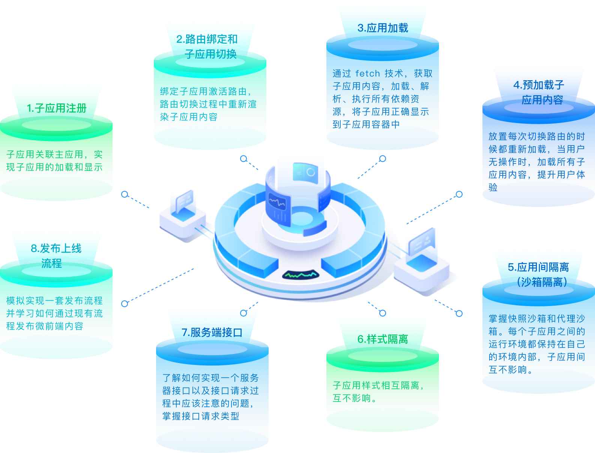

# 基础准备工作

凡事预则立不预则废，在做架构设计和架构实践之前，做好充分的准备工作，然后按照预先设定好的步骤一步步实现理想的架构设计，同时，架构设计工作并不仅仅由架构师完成，更重要的是要调动全员完成架构设计，也需要让项目组所有成员理解并认同自己的架构设计初衷，齐心协力完成架构设计工作。

## 微前端实现方式对比

1. Iframe
    - 优势：
        - 技术成熟
        - 支持页面嵌入
        - 天然支持运行沙箱隔离、独立运行
    - 劣势：
        - 页面之间可以是不同的域名，鉴权等处理麻烦
        - 需要对应的设计出一套应用通讯机制，如何监听，传参格式等内容
        - 应用加载、渲染、缓存等体系的实现
2. web component
    - 优势：
        - 支持自定义元素
        - 支持 shadow dom，并可通过关联进行控制
        - 支持模板 template 和插槽 slot，引入自定义组件内容
    - 劣势
        - 接入微前端需要重写当前项目
        - 生态系统不完善，技术过新容易出现兼容性问题
        - 整体架构设计复杂，组件与组件之间拆分过细时，容易造成通讯和控制繁琐
3. 自研框架
    - 优势：
        - 高度定制化，满足需要做兼容的一切场景
        - 独立的通信机制和沙箱运行环境，可解决应用之间相互影响的问题
        - 支持不同技术栈子应用，可无缝实现页面无刷新渲染
    - 劣势：
        - 技术实现难度较高
        - 需要设计一套定制的通信机制
        - 首次加载会出现资源过大的情况

最终实现-自研框架：
- 路由分发式
- 主应用控制路由匹配和子应用加载，共享依赖加载
- 子应用做功能，并接入主应用实现主子控制和联动

## 技术选型-确定技术栈

应用：
- 主应用
- 子应用
- 后端服务和发布应用

主应用-选定 vue3 技术栈：
- vue2
- vue3
- react
- Angular
- jQuery
- 原生JS

子应用：
- vue2 子应用
- vue3 子应用
- react15 子应用
- react16 子应用

服务端接口：
- koa 实现

发布应用：
- express 实现

## 项目架构图

1. 主应用
    - 注册子应用
    - 加载、渲染子应用
    - 路由匹配（activeWhen，rules - 有框架判断）
    - 获取数据（公共依赖，通过数据做鉴权处理）
    - 通信（父子通信，子父通信）

2. 子应用
    - 渲染
    - 监听通信（主应用传递过来的数据）

3. 微前端框架
    - 子应用的注册
    - 有开始内容（应用加载完成）
    - 路由更新判断
    - 匹配响应的子应用
    - 加载子应用的内容
    - 完成所有依赖项的执行
    - 将子应用渲染在固定的容器内
    - 公共事件的管理
    - 异常的捕获赫尔报错
    - 全局状态管理的内容
    - 沙箱隔离
    - 通信机制

3. 服务端功能
    - 提供数据服务

4. 发布平台
    - 主子应用的打包和发布

